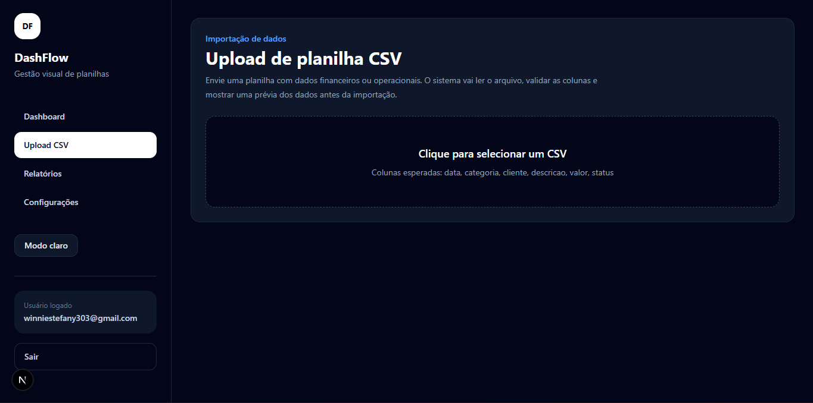

# DashFlow

Modern dashboard platform for transforming spreadsheets into interactive metrics, reports and operational insights.

DashFlow was built as a fast MVP SaaS focused on helping small businesses reduce manual work, centralize operational data and visualize financial indicators in a modern interface.

---

# Live Demo

https://dashflow-rho.vercel.app/

---

# Features

- Authentication with Supabase Auth
- Protected routes
- CSV upload and validation
- Financial dashboard
- Interactive charts
- Automatic reports
- User-based data isolation
- Responsive layout
- Light / Dark mode
- Supabase persistence

---

# Screenshots

## Dashboard Overview (Light Mode)


---

## Dashboard Analytics (Light Mode)


---

## Dashboard Transactions (Light Mode)


---

## Dashboard Overview (Dark Mode)


---

## Dashboard Analytics (Dark Mode)


---

## Dashboard Transactions (Dark Mode)


---

## Upload CSV



---

## Automatic Reports


---

## Authentication


---

# Product Vision

DashFlow focuses on operational simplicity and fast access to business insights.

The goal is to help businesses:

- reduce manual work
- centralize operational data
- visualize financial metrics
- organize workflows
- reduce human error
- improve reporting processes

---

# Tech Stack

## Frontend

- Next.js 15
- React
- TypeScript
- Tailwind CSS
- Recharts

## Backend & Infrastructure

- Supabase
- PostgreSQL
- Supabase Auth

---

# Application Flow

```text
User logs in
        ↓
User uploads CSV
        ↓
System validates columns
        ↓
Data is saved in Supabase
        ↓
Dashboard updates automatically
        ↓
Charts and reports are generated
```

---

# Architecture

```bash
src/
 ├── app/
 ├── components/
 ├── lib/
 ├── types/
```

---

# Local Development

## Clone repository

```bash
git clone https://github.com/winnie-s3/dashflow.git
```

## Open project

```bash
cd dashflow
```

## Install dependencies

```bash
npm install
```

## Configure environment variables

Create a `.env.local` file:

```env
NEXT_PUBLIC_SUPABASE_URL=YOUR_SUPABASE_URL
NEXT_PUBLIC_SUPABASE_ANON_KEY=YOUR_SUPABASE_ANON_KEY
```

## Run development server

```bash
npm run dev
```

---

# Roadmap

- [x] Authentication
- [x] CSV upload
- [x] Dashboard metrics
- [x] Interactive charts
- [x] Automatic reports
- [x] Dark mode
- [x] Responsive interface
- [x] Multi-user support
- [ ] XLSX upload
- [ ] PDF export
- [ ] Dashboard customization
- [ ] Report sharing
- [ ] Multi-company support
- [ ] External API integrations

---

# Target Audience

- Accounting offices
- Real estate agencies
- Financial teams
- HR operations
- Small businesses
- Family businesses
- Companies using Excel and WhatsApp as operational workflow

---

# Deployment

Hosted on Vercel.

---

# Status

Actively under development.