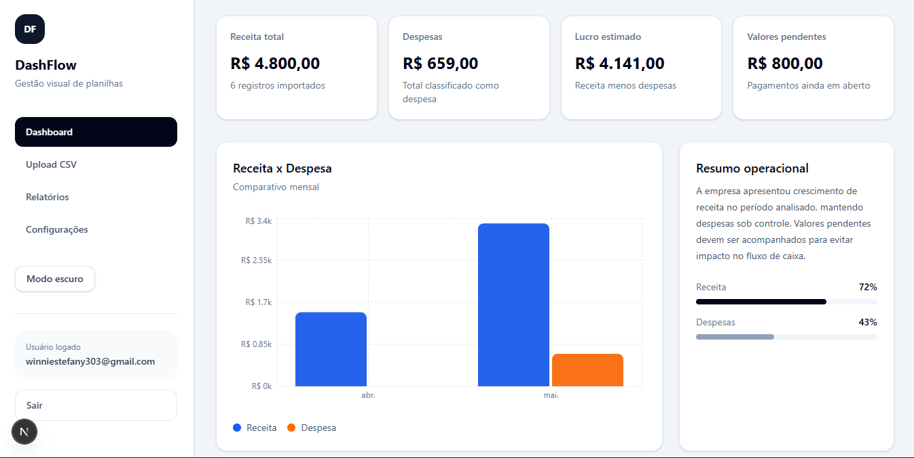
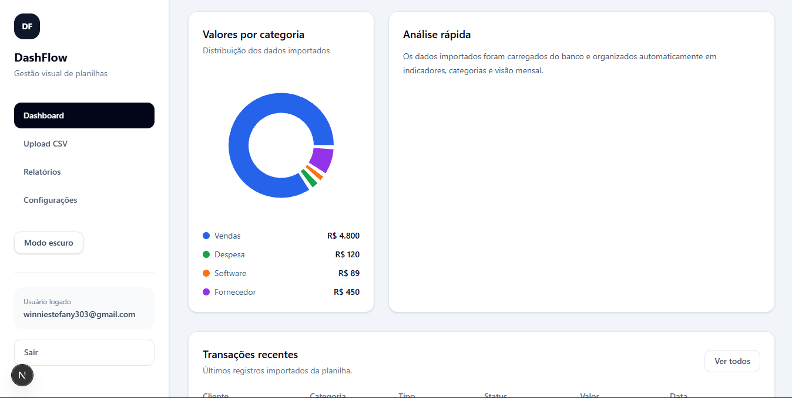
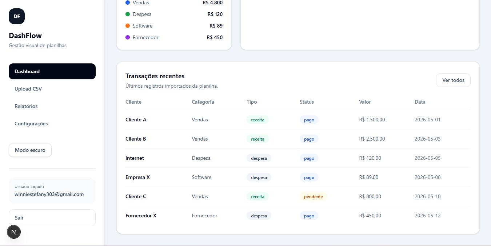
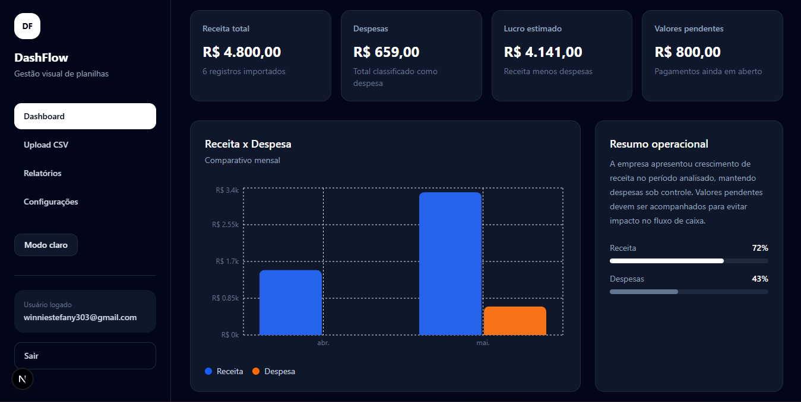
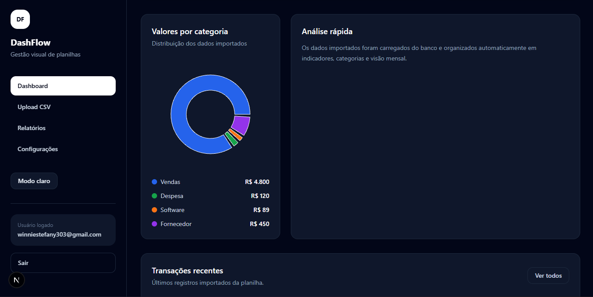
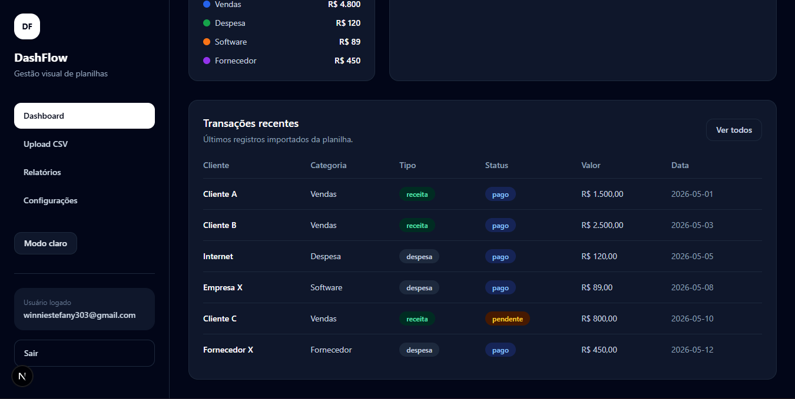
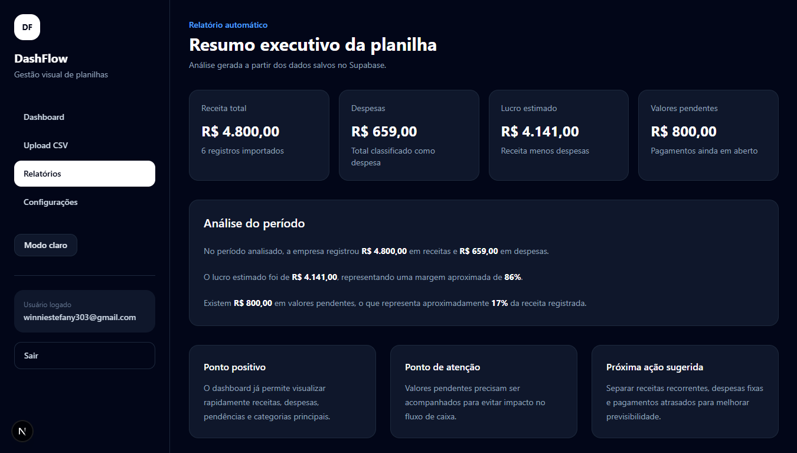
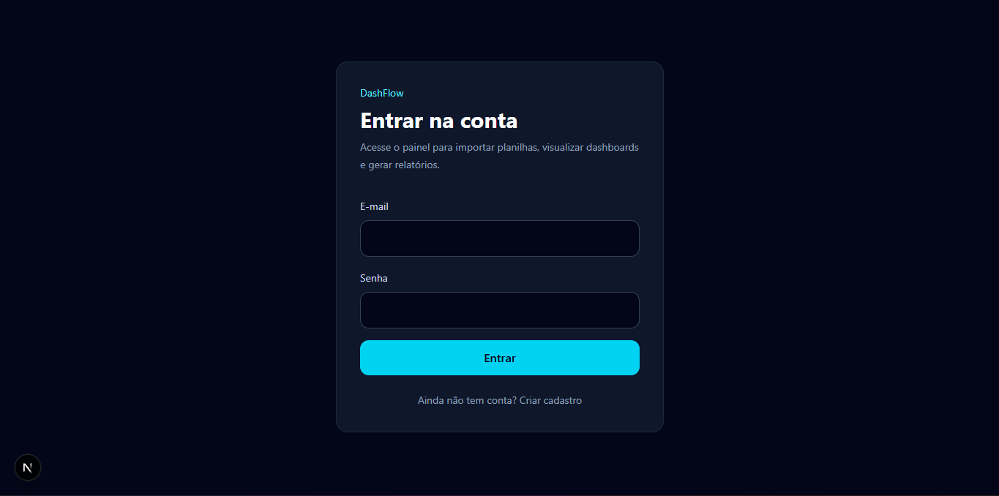

# DashFlow

Dashboard empresarial para visualização de métricas financeiras e operacionais a partir de planilhas CSV.

O projeto foi desenvolvido com foco em velocidade de construção, experiência visual moderna e automação de processos internos para pequenas empresas que ainda trabalham com Excel, WhatsApp e processos manuais.

---

# Objetivo

O DashFlow transforma planilhas em dashboards interativos e relatórios automáticos, permitindo visualizar receitas, despesas, métricas operacionais e dados consolidados em poucos segundos.

O foco principal é:

- organização operacional;
- redução de retrabalho;
- visualização rápida de indicadores;
- automação de relatórios;
- centralização de dados.

---

# Screenshots

## Dashboard Overview (Light Mode)



---

## Dashboard Analytics (Light Mode)



---

## Dashboard Transactions (Light Mode)



---

## Dashboard Overview (Dark Mode)



---

## Dashboard Analytics (Dark Mode)



---

## Dashboard Transactions (Dark Mode)



---

## Upload CSV (Dark Mode)


---

## Automatic Reports (Dark Mode)



---

## Login (Dark Mode)



---

# Funcionalidades

- autenticação com Supabase Auth;
- login e logout;
- proteção de rotas privadas;
- upload de planilhas CSV;
- validação automática de colunas;
- preview dos dados importados;
- dashboard com métricas financeiras;
- gráficos interativos;
- relatórios automáticos;
- persistência de dados com Supabase;
- separação de dados por usuário;
- tema claro e escuro;
- interface responsiva;
- análise visual de receitas e despesas.

---

# Stack

## Frontend

- Next.js
- React
- TypeScript
- Tailwind CSS
- Recharts

## Backend / Infra

- Supabase
- PostgreSQL
- Supabase Auth

---

# Arquitetura

```bash
src/
 ├── app/
 ├── components/
 ├── lib/
 ├── types/
```

---

# Fluxo da aplicação

```text
Usuário faz login
        ↓
Usuário envia CSV
        ↓
Sistema valida colunas
        ↓
Dados são salvos no Supabase
        ↓
Dashboard é atualizado automaticamente
        ↓
Relatórios e gráficos são gerados
```

---

# Como rodar localmente

## Clone o projeto

```bash
git clone https://github.com/winnie-s3/dashflow.git
```

## Entre na pasta

```bash
cd dashflow
```

## Instale as dependências

```bash
npm install
```

## Configure as variáveis de ambiente

Crie um arquivo `.env.local`

```env
NEXT_PUBLIC_SUPABASE_URL=YOUR_SUPABASE_URL
NEXT_PUBLIC_SUPABASE_ANON_KEY=YOUR_SUPABASE_ANON_KEY
```

## Rode o projeto

```bash
npm run dev
```

---

# Roadmap

- [x] Upload CSV
- [x] Dashboard financeiro
- [x] Relatórios automáticos
- [x] Login e autenticação
- [x] Persistência com Supabase
- [x] Tema claro/escuro
- [x] Multiusuário
- [ ] Upload XLSX
- [ ] Exportação PDF
- [ ] Dashboard customizável
- [ ] Compartilhamento de relatórios
- [ ] Multiempresa
- [ ] Integração com APIs externas

---

# Motivação

O projeto foi criado com foco em construção rápida de MVPs SaaS utilizando IA para acelerar desenvolvimento, prototipagem e implementação de interfaces modernas.

O objetivo é validar rapidamente soluções internas voltadas para pequenas empresas e operações que ainda dependem fortemente de processos manuais.

---

# Possíveis públicos

- escritórios;
- imobiliárias;
- contabilidade;
- RH;
- financeiro;
- empresas familiares;
- pequenos negócios que usam Excel e WhatsApp como principal fluxo operacional.

---

# Estratégia do produto

O foco do DashFlow não é vender “tecnologia”, e sim:

- economia de tempo;
- automação operacional;
- organização;
- redução de erros;
- redução de retrabalho;
- visualização rápida de dados.

---

# Deploy

Em breve.

---

# Status

Projeto em desenvolvimento contínuo.